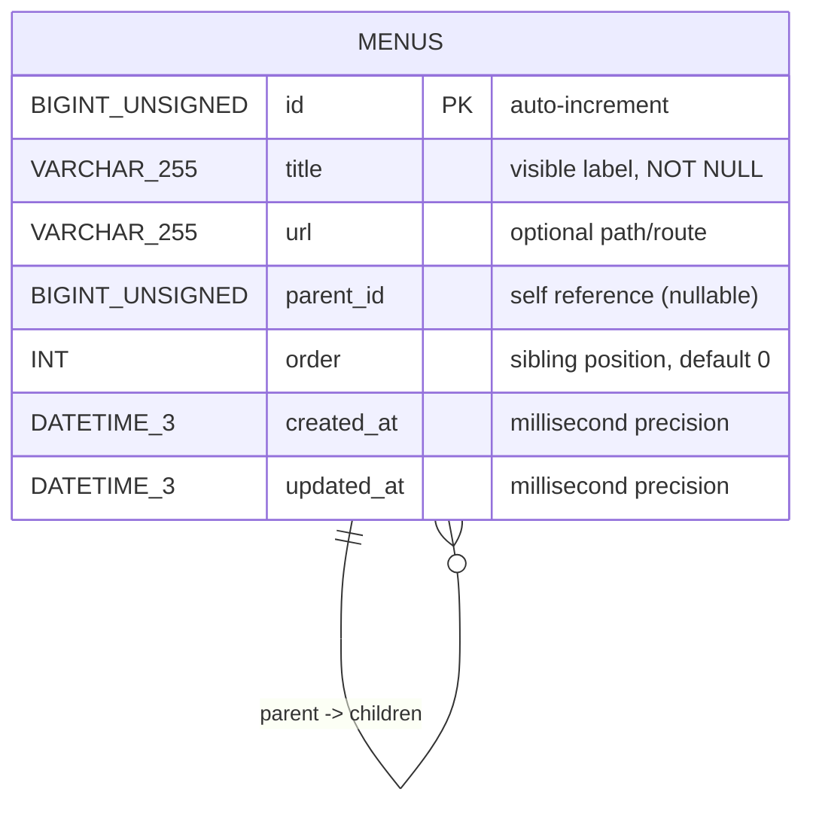

# ERD — Menu Tree (compact)

This diagram and notes are intended for reviewers who want a quick, accurate view of the schema and runtime expectations.

## Mermaid ERD


## Key points
- **Adjacency‑list model** (single table) — simple and easy to reason about for CRUD and reorder operations.
- **No DB-enforced FK**: application logic enforces deletion/move invariants and prevents cycles.
- **Sibling ordering**: stable and enforced in the service layer inside transactions.
- **No soft delete in SQL**: The Go model includes `deleted_at` via GORM, but the import SQL doesn't create this column. GORM AutoMigrate will add it on first run.
- **Indexes**: `idx_menus_parent_id` on `parent_id`, `idx_menus_order` on `order` for fast sibling queries.

## Migration / DDL
Authoritative DDL: `backend/migrations/001_create_menus.sql` (contains indexes used in queries and tests).

Sample data import: `backend/database/sotekre_menus_import.sql` (19 menu items matching Figma design).

> [!NOTE]
> The diagram above shows the SQL schema from the import file. The GORM model (`models/menu.go`) includes additional fields (`icon`, `deleted_at`) that will be added automatically by AutoMigrate when the backend first runs.

## Example verification queries
- Ordered root list:
```sql
SELECT id,title,`order` FROM menus WHERE parent_id IS NULL ORDER BY `order`, id;
```

- Ordered children for parent 1:
```sql
SELECT id,title,`order` FROM menus WHERE parent_id = 1 ORDER BY `order`, id;
```

- Recursive subtree (MySQL 8+):
```sql
WITH RECURSIVE tree AS (
  SELECT * FROM menus WHERE id = 1
  UNION ALL
  SELECT m.* FROM menus m JOIN tree t ON m.parent_id = t.id
)
SELECT * FROM tree ORDER BY parent_id, `order`, id;
```

## Performance & indexes
- Indexes: `idx_parent(parent_id)`, `idx_order(order)` — support fast sibling enumeration and scanning by parent.
- For very large trees, consider materialized path or closure table patterns; adjacency list is chosen here for simplicity and interview-readability.

## Changing the schema
1. Add a new migration SQL under `backend/migrations/` with an incremental filename.
2. Update `backend/models/menu.go` and add/update tests under `backend/services` and `backend/handlers`.
3. Run `go test ./...` and include a migration check in CI.

---

Files
- `backend/migrations/001_create_menus.sql`
- `backend/models/menu.go`
- `backend/services/menu_service.go`
```