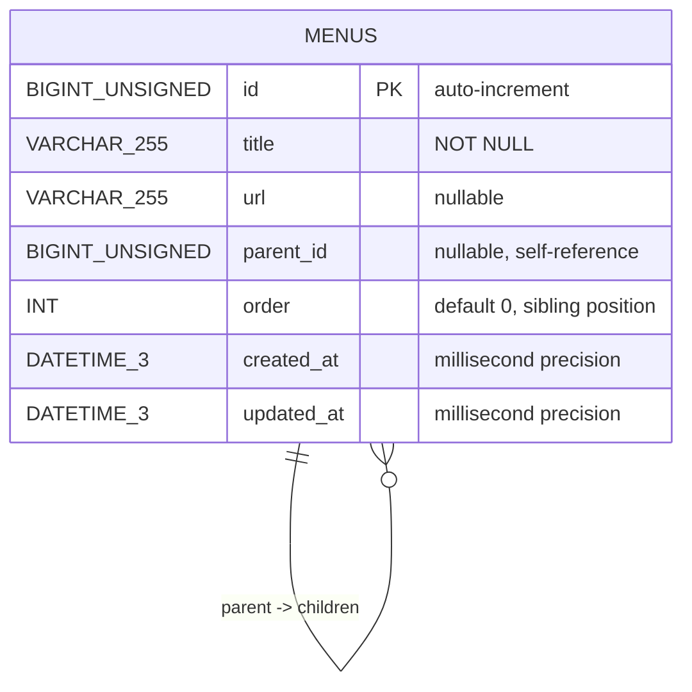

# Database — Menu Tree (backend)

Authoritative database documentation for reviewers and contributors. This file mirrors the main project README style (clickable TOC, quick verification, reviewer checklist) so reviewers can find DB information immediately.

---

## Table of contents
- [Status](#status)
- [Quick verification](#quick-verification)
- [Schema & authoritative sources](#schema--authoritative-sources)
- [ERD (visual)](#erd-visual)
- [Migrations & running locally](#migrations--running-locally)
- [Example queries (verification)](#example-queries-verification)
- [Indexes, constraints & rationale](#indexes-constraints--rationale)
- [Testing & CI guidance](#testing--ci-guidance)
- [Reviewer checklist](#reviewer-checklist)
- [Reference files](#reference-files)

---

## Status
- Ready for review: schema, migration, and service invariants are implemented and covered by unit + integration tests.
- Scope: single-table adjacency-list (`menus`) with transactional move/reorder and recursive delete handled by application logic.

## Quick verification
Commands reviewers typically run locally or in CI to sanity-check the database:

```bash
# 1) Start the app (AutoMigrate will create the table)
cd backend
go run .

# 2) Simple API smoke-check
curl -s http://localhost:8080/api/menus | jq .

# 3) Inspect DDL (MySQL/XAMPP)
mysql -uroot -p -e "USE sotekre_dev; SHOW CREATE TABLE menus\G"

# 4) Run tests that exercise DB logic
cd backend && go test ./... -v
```

## Schema & authoritative sources
- Migration (MySQL): `backend/migrations/001_create_menus.sql` — DDL and indexes
- Application model: `backend/models/menu.go` (GORM)
- Sample data: `backend/database/sotekre_menus_import.sql` — Import file for quick setup
- Business logic & invariants: `backend/services/menu_service.go`

> [!NOTE]
> The GORM model (`menu.go`) includes additional fields (`icon`, `deleted_at`) not present in the sample SQL import file. When you run the backend, GORM's `AutoMigrate` will add these columns automatically. The import SQL creates the minimal required schema.

> [!TIP]
> Always update both the migration and the GORM model when changing the schema; include tests that validate the new behavior.

## ERD (visual)
A compact Mermaid ERD is available here and in `backend/database/ERD.md`.



## Migrations & running locally
- Development (MVP): the server runs `AutoMigrate` on startup for rapid iteration.

```bash
# XAMPP/local MySQL (use backend/.env or rename backend/.env.example -> backend/.env)
cd backend
go run .
```

- Production: use an explicit migration runner (e.g. `golang-migrate`).

Migration workflow (recommended):
1. Add SQL under `backend/migrations/` with an incremental filename.
2. Update `backend/models/menu.go` to reflect the model.
3. Add tests (`backend/services` / `backend/handlers`) covering the behavior.

## Sample data import (quick start)
For rapid demo setup, use the included sample data file that matches the Figma design:

**File:** `backend/database/sotekre_menus_import.sql`

**Contents:** 19 pre-configured menu items matching the application design, including:
- system management (root)
- System Management → Systems → System Code, Menus, API List
- Users & Groups → Users, Groups
- 사용자 승인 (User Approval with Korean text)

### Import via phpMyAdmin (XAMPP)
1. Open phpMyAdmin: `http://localhost/phpmyadmin`
2. Select database `sotekre_dev` (create if needed)
3. Click "Import" tab
4. Choose file: `backend/database/sotekre_menus_import.sql`
5. Click "Go"
6. Refresh frontend at `http://localhost:3000`

### Import via command line
```bash
# If MySQL is in PATH
mysql -u root -P 3306 -h 127.0.0.1 sotekre_dev < backend/database/sotekre_menus_import.sql

# Verify
mysql -u root -P 3306 -h 127.0.0.1 sotekre_dev -e "SELECT COUNT(*) FROM menus;"
```

> [!NOTE]
> The import file includes `TRUNCATE TABLE menus;` to clear existing data. Remove lines 31-33 if you want to keep existing menus.

## Example queries (verification)
- Ordered root items:
```sql
SELECT id, title, parent_id, `order` FROM menus WHERE parent_id IS NULL ORDER BY `order`, id;
```

- Ordered children for parent = 1:
```sql
SELECT id, title, `order` FROM menus WHERE parent_id = 1 ORDER BY `order`, id;
```

- Recursive subtree (MySQL 8+):
```sql
WITH RECURSIVE subtree AS (
  SELECT * FROM menus WHERE id = 1
  UNION ALL
  SELECT m.* FROM menus m JOIN subtree s ON m.parent_id = s.id
)
SELECT * FROM subtree ORDER BY parent_id, `order`, id;
```

- Minimal seed for manual testing:
```sql
INSERT INTO menus (title, parent_id, `order`) VALUES
('A', NULL, 0), ('B', NULL, 1), ('A.1', 1, 0);
```

## Indexes, constraints & rationale
- Indexes: `idx_parent (parent_id)`, `idx_order (order)` — support fast sibling enumeration and parent-scoped scans.
- FK constraints: intentionally omitted to keep deletion/soft-delete semantics and test control in application code.
- Ordering: `order` is normalized inside a DB transaction by the service layer during move/reorder operations to ensure consistency.

## Testing & CI guidance
- Unit & integration tests use in-memory SQLite for fast, hermetic runs (`backend/*_test.go`).
- CI should:
  - run `go generate ./...` (if docs are generated),
  - boot a disposable DB (or use a service in CI),
  - apply migrations, and
  - run `go test ./... -v`.

Example (GitHub Actions snippet, high level):
```yaml
# - name: Run tests
#   run: |
#     docker run -d --name mysql -e MYSQL_ROOT_PASSWORD=$MYSQL_ROOT_PASSWORD mysql:8
#     # wait + run migrations + go test
```

## Reviewer checklist
- [ ] Model ↔ migration parity (`backend/models/menu.go` vs `backend/migrations/001_create_menus.sql`).
- [ ] Move/Reorder invariants: cycle prevention + transactional sibling reindexing (`backend/services/menu_service.go`).
- [ ] Recursive delete behavior and soft-delete semantics (`backend/handlers` integration tests).
- [ ] Indexes and query shapes for expected workloads (sibling enumeration).

---

## Reference files
- `backend/migrations/001_create_menus.sql`
- `backend/models/menu.go`
- `backend/services/menu_service.go`
- `backend/handlers/*` (integration tests)
